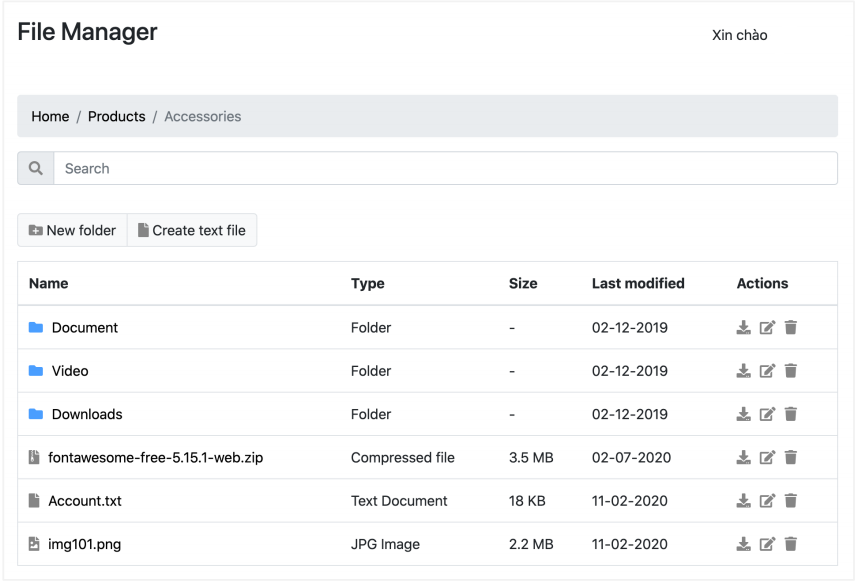

# Chi tiết về trang web FileManager
Website này mình Sử dụng ExpressJS và các module khác để phát triển trang web quản lý tập tin. Trang 
web có các tính năng như: đăng ký tài khoản, đăng nhập và quản lý tập tin/thư mục. Cụ thể sẽ được trình bày dưới đây
  
## Đăng ký tài khoản
Các thông tin cần được cung cấp bao gồm tên người dùng, địa chỉ
email và mật khẩu. Những thông tin này cần được lưu vào cơ sở dữ liệu MySQL. Mật 
khẩu cần được hash bằng bcrypt trước khi lưu vào database. Hai form đăng ký/đăng nhập sử dụng csrf token để phòng chống 
tấn công cross site request forgery. Đây là giao diện của trang Register

## Đăng nhập
Sử dụng tài khoản đã đăng ký trước đó để đăng nhập. Nếu chưa đăng nhập mà người dùng truy cập vào trang chủ thì sẽ được chuyển hướng tự động đến trang đăng nhập.
Nếu đã đăng nhập rồi mà người dùng cố tình truy vập vào trang đăng nhập/đăng ký thì sẽ được chuyển hướng tự động về trang chủ. 
Dưới đây là giao diện của trang Login

## Trang chủ

Trang chủ hiện thị giao diện để người dùng quản lý tập tin và thư mục. Trang chủ có giao diện như sau:

Trang chủ này cung cấp các chức năng như:

  - Liệt kê danh sách tập tin và thư mục: Sắp xếp thư mục ở trước, tập tin sau. 
  - Hiển thị các thông tin phụ như icon, loại tập tin, kích thước, ngày cập nhật…
  - Xem tập tin: Khi click vào một tập tin thì trình duyệt sẽ mở tập tin hoặc tải tập 
  tin về (mình sử dụng express static để thực hiện tính năng này).
  - Upload một tập tin mới: Cụ thể mình sử dụng ajax/fetch để upload tập tin và hiển thị thanh 
  tiến trình trong quá trình upload. Chỉ cho phép upload một tập tin vào một thời điểm.
  - Tạo thư mục mới, đổi tên tập tin/thư mục, xóa tập tin/thư mục: Trang web của mình sẽ hiển thị
  confirm dialog phù hợp trước khi xóa/thay đổi dữ liệu.

  

  - Tìm kiếm tập tin và thư mục: ngay khi gõ từ khóa cần tìm thì kết quả sẽ được lọc ra, chỉ hiển thị kết quả phù hợp trong danh sách tập tin.

   
   
  - Tải tập tin/thư mục: Khi click vào download icon kế bên mỗi tập tin/thư mục thì trang web sẽ tải xuống tập tin/thư mục đó (mà không cần chuyển trang). Nếu là thư mục, trang web sẽ tải về tập tin nén dạng zip của thư mục. Sau khi đã tải về thành công, tập tin zip của thư mục sẽ được xóa tự động trên server (sử dụng các header như Content-Type, Content-Disposition để hiện thực tính năng này). Ngoài ra, có thể áp dụng giới hạn tốc độ download tập tin.
  - Di chuyển giữa các thư mục: Khi click vào một thư mục bất kỳ thì các tập tin và thư mục con bên trong của thư mục đó sẽ được hiển thị. Ngoài ra, khi đang  ở một thư mục bất kỳ thì luôn có thể di chuyển nhanh chóng đến thư mục gốc hoặc một trong các thư mục cha của thư mục hiện đó (thông qua Bootstrap Breadcrumb)

## Tổng kết
Dưới đây là một vài modules trong Express mà mình sử dụng:

1. `cookie` và `session` hiện thực chức năng đăng nhập.
2. `express static` để phục vụ các tập tin tĩnh trên server.
3. `fs` để đọc và ghi tập tin trên server.
4. `multer` để xử lý upload tập tin.
5. Kết nối và tương tác với cơ sở dữ liệu MySQL sử dụng `mysql` 
6. `bcrypt` để hash mật khẩu người dùng.
7. `cross site request forgery token` để phòng chống tấn công csrf.
8. `ajax/fetch` kết hợp với rest api phía server để thực hiện các tính năng cần 
đọc/thay đổi dữ liệu từ server mà không cần tải lại trang web
9. `express-form`, `express-validator` để kiểm tra dữ liệu từ HTML form.
10. `flash messsage` để gửi thông báo thông báo giữa các routes.
11. `rate limit` trong express để phòng chống tấn công DDOS
